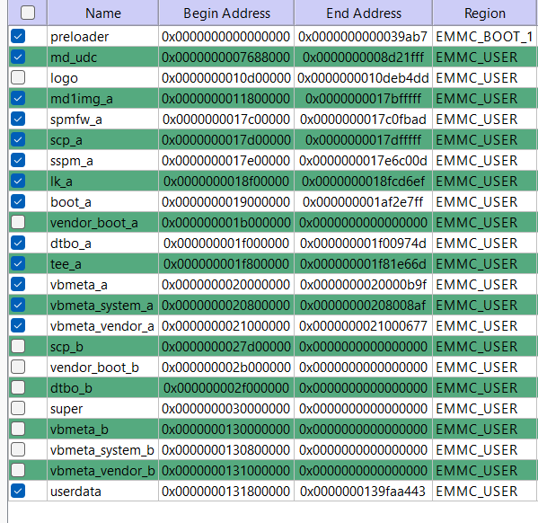

# הוראות צריבת מערכת Dumbdroid
הוראות צריבה מפורטות עם פתרון בעיות שאני נתקלתי בהם
## 1. גיבוי
עדיף לגבות את הקושחה לפני כל פעולה מדריך מפורט לשאיבת הקושחה יפורסם במאגר נפרד
## 2 צריבת הקושחה 
1. הפעל מצב מפתחים והפעל מצב ניפוי שגיאות USB
2. הרצת הפקודה `adb reboot fastboot` תעביר את המכשיר למצב reboot
> הצריבה מתאפשרת רק עם Recovery מקורי ולא TWRP תוכל להוריד ריקוברי מקורי עבור F21 PRO [כאן](https://github.com/start-life/Dumbdroid-system-burning-instructions/releases/download/1.0/boot_a.bin)  
> שם לב שאתה במצב  fastboot ולא bootloader הפקודה `adb reboot bootloader` לא מתאימה לצריבת מחיצת system
3. צרוב את הקושחה עם הפקודה `fastboot flash system ???.img`
> **💡טיפ** תוכל לבדוק האם המכשיר שלך מחובר עם הפקודה `fastboot devices`
> לעיתים עלול להופיע שגיאה אם זה צורב למחיצת  system_b הצריבה צריכה להיות למחיצת system_a כדי לפתור את זה עבור על השלבים הבאים:
> 1. בדוק איזה חריץ פעיל עם הפקודה `fastboot getvar current-slot` (הסבר💡 fastboot getvar current-slot — שואלת את ה־bootloader באיזה slot המכשיר עובד כרגע (a או b).
אם התוצאה היא: `current-slot: a` המשמעות: המכשיר כעת משתמש ב־slot A.
ואם התוצאה: `current-slot: b` אז המכשיר פעיל כרגע ב־slot B.
כדי להחליף slot פעיל: `fastboot set_active a` או `fastboot set_active b`
> 2. אם אתה מקבל שגיאות שמחיצת המערכת קטנה מדי או שלא ניתן לשנות את גודלה, נסה להבהב את גרסת dumbdroid ללא שרותי גוגל ולעבור ל-g-apps לאחר מכן דרך הגדרות->מערכת->עדכונים.
4. הפעל את המכשיר מחדש `fastboot reboot` אתחול המערכת בפעם הראשונה עשוי להימשך 5-10 דקות
## שיחזור הקושחה המקורית
אני ניסיתי לשחזר במצב fastboot למרות שאפשר גם עם mtkclient כיוון שמכשיר שלי לא הצלחתי להתחבר לmtkclient   
לאחר המון מאמצים הצלחתי לשחזר את הגרסה אלו השלבים שעשיתי יתכן שלא כולם נחוצים
1. ניקוי מחיצות
```
fastboot erase userdata
fastboot erase metadata
fastboot erase system
```
2. צריבת מחיצת super מהגיבוי שלך
```
fastboot flash super super
```
> לאחר שלבים אלו הטלפון נדלק אבל נשאר על שלב אנמציית הלוגו כדי להצליח לשחזר באופן מלא עשתי את הצעדים הבאים 👇
3. צריבת מחיצות אלו מקושחה גלובלית נקיה עם SP Flash Tool
      


> היי 🎉 יצרתי קובץ super של הגרסה הזו כעת תוכל לצרוב את זה בקלות עם SP Flash Tool כרגע זה עבור qin f22 pro עבור **גרסת ונילה** הורד [כאן](https://github.com/start-life/Dumbdroid-system-burning-instructions/releases/download/1.0/qin.f22.pro.lineage-21.0-20251014-UNOFFICIAL-dumb_vanilla31_Not.Google.rar) **גרסת גוגל** [כאן](https://github.com/start-life/Dumbdroid-system-burning-instructions/releases/download/1.0/qin.f22.pro.lineage-21.0-20251014-UNOFFICIAL-dumb_gapps31-signed.img.rar)
